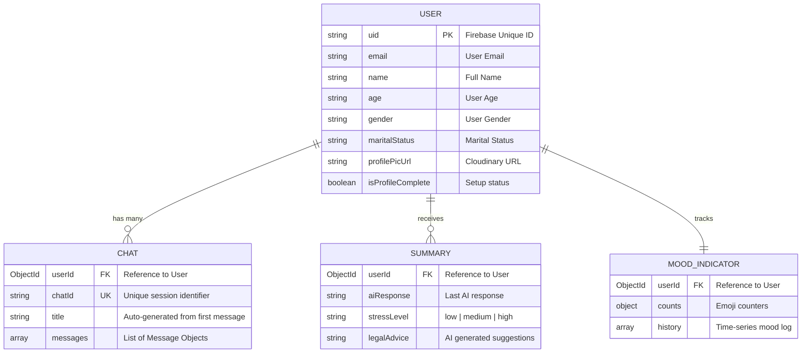

# AegisAI Database Schema Documentation

AegisAI utilizes MongoDB for persisting user profiles, chat history, AI analysis results, and mood tracking. Below is the structure of our core data models.

## Entities and Relationships



## Collection Details

### 1. Users (`User` model)
Stores basic user identity and profile metadata. Linked to Firebase Authentication via the `uid` field.

| Field | Type | Description |
| :--- | :--- | :--- |
| `uid` | String | Unique identifier from Firebase Auth. |
| `email` | String | User's registered email address. |
| `name` | String | Full name of the user. |
| `age` | String | User's age. |
| `gender` | String | User's gender. |
| `maritalStatus` | String | Marital status. |
| `profilePicUrl` | String | Cloudinary URL for profile picture. |
| `secretKey` | String | Optional extra security key for dashboard access. |
| `isProfileComplete` | Boolean | Tracks if the user has completed the onboarding flow. |

### 2. Chats (`Chat` model)
Stores conversation history as **individual chat sessions**. Each document = one chat session for one user.

| Field | Type | Description |
| :--- | :--- | :--- |
| `userId` | ObjectId | Reference to the `User` collection. |
| `chatId` | String | **Unique** identifier for this chat session (timestamp-based). |
| `title` | String | Auto-generated from the user's first message in the session. |
| `messages` | Array | Ordered list of message objects for this session only. |

Each message object contains:

| Field | Type | Description |
| :--- | :--- | :--- |
| `message` | String | The text content of the message. |
| `sender` | Enum | Either `"user"` or `"bot"`. |
| `emotion` | String | (Optional) Detected emotion for this message. |
| `isFlagged` | Boolean | Whether this message was flagged for review. |
| `timestamp` | Date | When the message was sent. |

> [!IMPORTANT]
> Each user can have **multiple** Chat documents. The `chatId` field is unique across the entire collection. Sessions are loaded lazily — only the session list (titles) is fetched initially, and full messages are loaded on-demand when a user clicks a specific chat.

### 3. Summaries (`Summary` model)
Stores structured AI output after analyzing user messages for stress and risk levels.

| Field | Type | Description |
| :--- | :--- | :--- |
| `userId` | ObjectId | Reference to the `User` collection. |
| `aiResponse` | String | The full AI-generated response text. |
| `stressLevel` | Enum | Categorized as `low`, `medium`, or `high`. |
| `legalAdvice` | String | Actionable tips or legal resources suggested by the AI. |

### 4. Mood Indicators (`MoodIndicator` model)
Tracks emotional state distribution for each user. One document per user.

| Field | Type | Description |
| :--- | :--- | :--- |
| `userId` | ObjectId | Reference to the `User` collection. |
| `counts` | Object | Aggregate counters: `{ "😄": 7, "🙂": 3, ... }` |
| `history` | Array | Time-series log of mood events with `emoji`, `source`, `timestamp`. |

> [!TIP]
> See [mood-indicator.md](mood-indicator.md) for full documentation on mood weights, AI emotion mapping, and stress graph implementation.

---

> [!NOTE]
> All collections include automatic `timestamps` (`createdAt` and `updatedAt`) managed by Mongoose.

## Migration Note

> [!WARNING]
> If upgrading from the old single-document chat schema (where `userId` was `unique`), you may need to drop the old `chats` collection or remove the stale unique index on `userId`. Run the following in MongoDB shell if needed:
> ```
> db.chats.dropIndex("userId_1")
> ```
