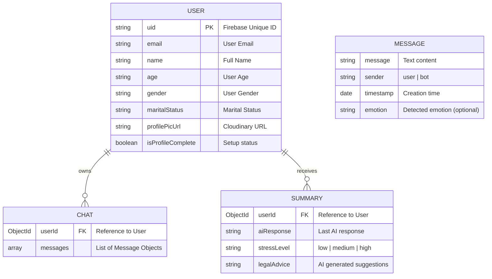

# AegisAI Database Schema Documentation

AegisAI utilizes MongoDB for persisting user profiles, chat history, and AI analysis results. Below is the structure of our core data models.

## Entities and Relationships

## Collection Details

### 1. Users (`User` model)
Stores basic user identity and profile metadata. Linked to Firebase Authentication via the `uid` field.

| Field | Type | Description |
| :--- | :--- | :--- |
| `uid` | String | Unique identifier from Firebase Auth. |
| `email` | String | User's registered email address. |
| `isProfileComplete` | Boolean | Tracks if the user has completed the onboarding flow. |

### 2. Chats (`Chat` model)
Stores all conversation history between a user and the AegisAI bot.

| Field | Type | Description |
| :--- | :--- | :--- |
| `userId` | ObjectId | Reference to the `User` collection. |
| `messages` | Array | A list of message objects, each containing `message`, `sender`, and `timestamp`. |

### 3. Summaries (`Summary` model)
Stores structured AI output after analyzing user messages for stress and risk levels.

| Field | Type | Description |
| :--- | :--- | :--- |
| `userId` | ObjectId | Reference to the `User` collection. |
| `stressLevel` | Enum | Categorized as `low`, `medium`, or `high`. |
| `legalAdvice` | String | Actionable tips or legal resources suggested by the AI. |

---

> [!NOTE]
> All collections include automatic `timestamps` (`createdAt` and `updatedAt`) managed by Mongoose.
