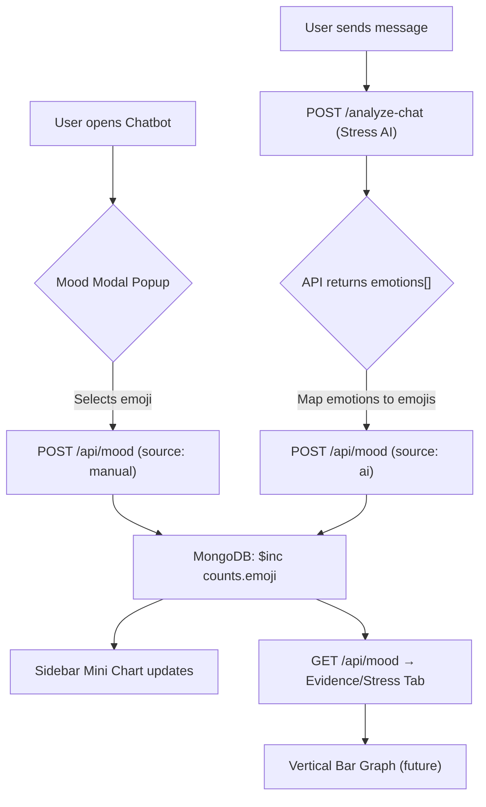

# AegisAI Mood Indicator System

## Overview

The Mood Indicator System tracks user emotional state through two channels:
1. **Manual Check-In** — A popup modal asks the user "How is your day going?" when they open the chatbot.
2. **AI Inference** — The Stress & Safety AI analyzes each chat message and returns detected emotions, which are automatically mapped to the mood emojis.

---

## Emoji Scale & Stress Weights

Each emoji has a numeric **stress weight**. Lower weight = happier, higher weight = more stressed.

| Emoji | Label     | Stress Weight |
|:-----:|:----------|:-------------:|
| 😄    | Great     | 0             |
| 🙂    | Good      | 1             |
| 😐    | Okay      | 2             |
| 😕    | Not great | 3             |
| 😢    | Sad       | 4             |
| 😭    | Terrible  | 5             |

> [!IMPORTANT]
> **Graph Interpretation**: For the bar graph, lower stress should correspond to **taller** bars (indicating more time feeling well). Use the formula:
> ```
> barHeight = (MAX_WEIGHT - emojiWeight) * count
> ```
> This means 😄 (weight 0) produces the tallest bars, while 😭 (weight 5) produces the shortest.

---

## Data Structure

### MongoDB Model: `MoodIndicator`

```json
{
  "userId": "ObjectId (ref: User)",
  "counts": {
    "😄": 7,
    "🙂": 3,
    "😐": 1,
    "😕": 4,
    "😢": 8,
    "😭": 5
  },
  "history": [
    {
      "emoji": "😢",
      "source": "manual",
      "timestamp": "2026-04-18T15:00:00Z"
    },
    {
      "emoji": "😕",
      "source": "ai",
      "timestamp": "2026-04-18T15:05:00Z"
    }
  ],
  "createdAt": "...",
  "updatedAt": "..."
}
```

### Fields

| Field | Type | Description |
|:------|:-----|:------------|
| `userId` | ObjectId | Reference to the User collection. One document per user. |
| `counts` | Object | Aggregate counters for each emoji. Incremented atomically via `$inc`. |
| `history` | Array | Time-stamped log of every mood event with its source (manual or AI). |

---

## Data Flow



---

## AI Emotion Mapping

The Stress AI returns an `emotions[]` array (e.g., `["anxiety", "fear"]`). These are mapped to emojis:

| AI Emotions | Mapped To |
|:------------|:---------:|
| joy, happiness, excited, grateful, love | 😄 |
| calm, content, hopeful, relief, positive | 🙂 |
| neutral, bored, confused, uncertain | 😐 |
| anxiety, worry, frustrated, stressed, nervous | 😕 |
| sadness, lonely, disappointed, hurt, guilt | 😢 |
| fear, anger, despair, helpless, terror, panic | 😭 |

> [!NOTE]
> If an emotion is not found in the mapping table, it defaults to 😐 (neutral).

---

## API Endpoints

### `GET /api/mood?uid=<firebase_uid>`
Returns the mood counts and last 50 history entries.

**Response:**
```json
{
  "counts": { "😄": 7, "🙂": 3, "😐": 1, "😕": 4, "😢": 8, "😭": 5 },
  "history": [...]
}
```

### `POST /api/mood`
Records a mood event.

**Body:**
```json
{
  "uid": "firebase_uid",
  "emoji": "😢",
  "source": "manual"
}
```

---

## Building the Stress Graph (For Contributors)

To build the vertical bar graph in the **Evidence/Stress** tab:

### Step 1: Fetch Data
```typescript
const res = await fetch(`/api/mood?uid=${uid}`);
const { counts } = await res.json();
// counts = { "😄": 7, "🙂": 3, "😐": 1, "😕": 4, "😢": 8, "😭": 5 }
```

### Step 2: Calculate Bar Heights
Use the **inverted weight** formula so happier moods = taller bars:

```typescript
const MAX_WEIGHT = 5;
const weights: Record<string, number> = {
  "😄": 0, "🙂": 1, "😐": 2, "😕": 3, "😢": 4, "😭": 5
};

const barData = Object.entries(counts).map(([emoji, count]) => ({
  emoji,
  count,
  // Score: higher = better wellbeing
  wellbeingScore: (MAX_WEIGHT - weights[emoji]) * count,
  // For raw stress visualization
  stressScore: weights[emoji] * count,
}));
```

### Step 3: Render Bars
```
😄 ████████████████████  7  (wellbeing: 35)
🙂 ████████████          3  (wellbeing: 12)
😐 ██████                1  (wellbeing:  3)
😕 ████████              4  (wellbeing:  8)
😢 ████                  8  (wellbeing:  8)
😭 ██                    5  (wellbeing:  0)
```

### Step 4: Compute Overall Stress Index
```typescript
const totalEvents = Object.values(counts).reduce((a, b) => a + b, 0);
const weightedSum = barData.reduce((acc, d) => acc + d.stressScore, 0);
const stressIndex = totalEvents > 0 ? Math.round(weightedSum / totalEvents * 20) : 0;
// stressIndex: 0-100 scale (0 = fully calm, 100 = extremely stressed)
```

> [!TIP]
> Use the `history` array (with timestamps) to build **time-series charts** showing mood changes over hours, days, or weeks.

---

## Design Decisions

### Why counters + history log?
- **Counters** (`counts`) enable O(1) reads for the bar graph — no need to aggregate on every page load.
- **History** (`history[]`) enables time-series analysis, trend detection, and future features like "mood over the week."

### Why atomic `$inc`?
MongoDB's `$inc` operator is atomic, so concurrent mood updates (e.g., manual + AI at the same time) never cause data races.

### Why map AI emotions?
The Stress AI returns free-form emotion labels. Mapping them to a fixed set of 6 emojis provides a consistent, visual vocabulary that works across the dashboard.
